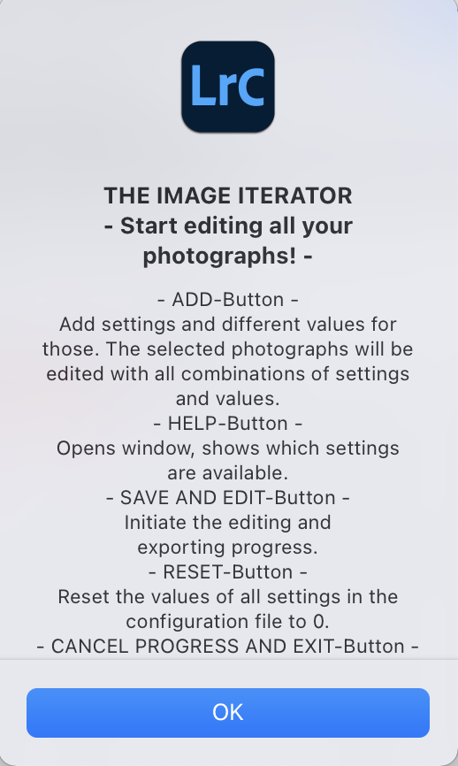
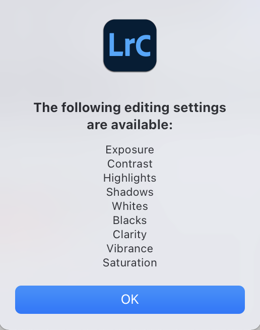
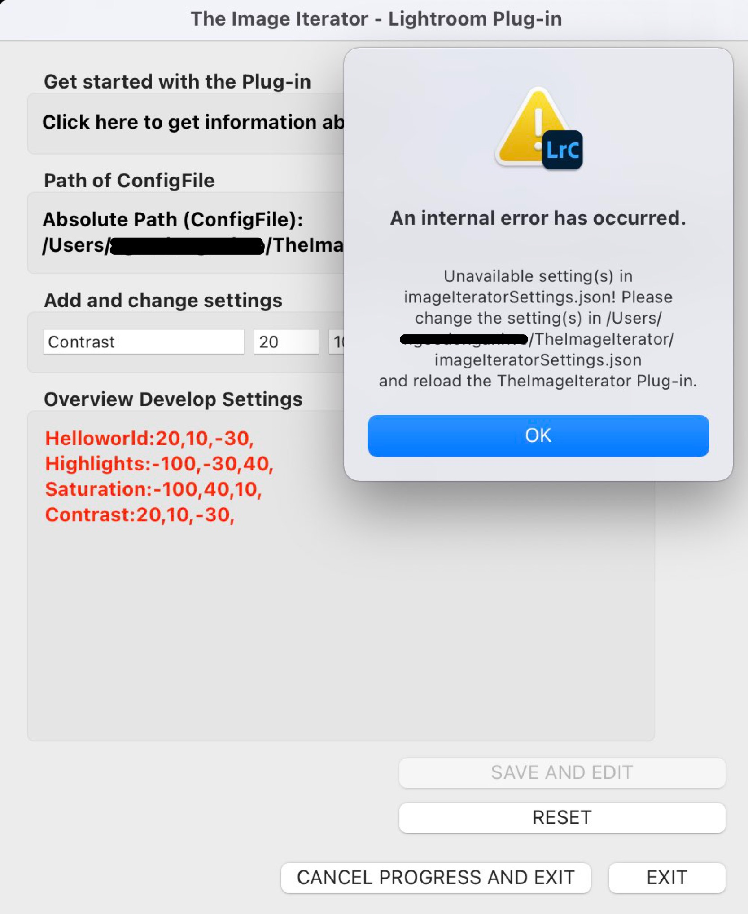
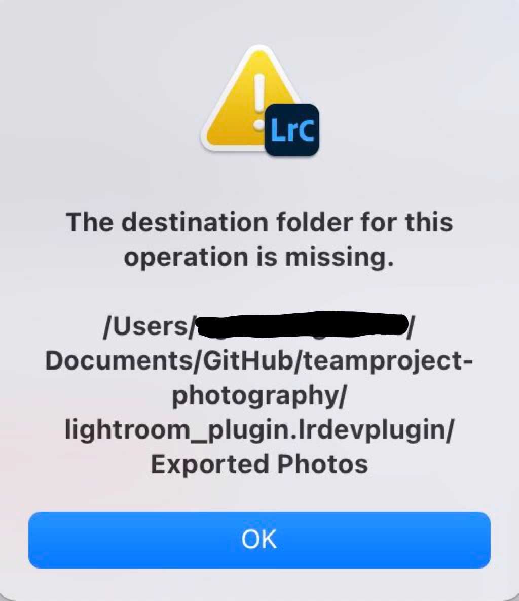
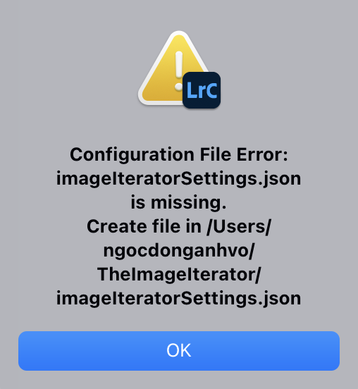
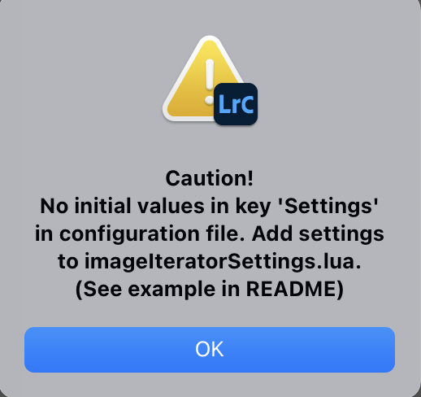

***
# ⭐ THE IMAGE ITERATOR 📸 ⭐
***
***

### Teamproject Summer Term 2021 - Photography


## Table of Contents
1. [About the project](#about-the-project)
2. [Features](#features)
4. [Getting Started](#getting-started)
5. [Usage](#usage)
6. [Contributing](#contributing)
7. [Acknowledgements](#acknowledgements)
8. [License](#license)
9. [Sources](#sources)

## 👥About the project 

This is the repository for the teamproject course, summer term 2021, working on automating photography manipulation.
The plugin is part of the teamproject of the University of Tübingen.


### Who are we?

We are 4 students at the University of Tübingen and we are all studying computer science. 


## 🌅Features

* The special thing about our plugin is that you can select several images at once and import, export and edit them.
* includes export of your selected images in a matrix-modification format
* processes the images using all possible combinations e.g. Contrast = [10,20], Saturation = [30,40] <br>
the following combinations will be applied on your selected photos: <br>
{[Contrast = 10, Saturation = 30],[Contrast = 10 , Saturation = 40], [Contrast = 20, Saturation = 30], [Contrast = 20 , Saturation = 40]}
* available settings: Exposure, Contrast, Highlights, Shadows, Whites, Blacks, Clarity, Vibrance, Saturation


## 🛠Getting Started

Add:

* language: Lua
* works with Adobe Lightroom Classic 10.3

### Set up
+ Download the whole project or only the folder `lightroom_plugin.lrdevplugin`. The folder itself can be anywhere on your computer.
+ Create a new directory called "TheImageIterator" under the standard home directory.

  Home directory..

     + for Windows: `C/Users/username/`
  
     + for Mac OS: `/Users/username/`
  
+ Make sure to save the configuration file [`imageIteratorSettings.json`](lightroom_plugin.lrdevplugin/imageIteratorSettings.json) under this folder. 
+ Add the Plug-in in Lightroom Classic: File -> Plug-in Manager... -> Add -> Select the folder of the plugin `lightroom_plugin.lrdevplugin` -> Done

+ Choose the pictures you want to edit.
+ Execute the Plug-in: Library -> Plug-in Extras -> The Image Iterator


## 💡 Usage
+ After opening the Plug-in you can see the path of your created configuration file under the standard home directory.
+ `Overview Develop settings` displays all settings, that were initially added to the configuration file (see [Config file](#config-file)) and the current content of the key "Settings" in the configuration file.

+ If you need any help for using the Plug-in press the SUPPORT-Button. The following window will pop up:


+ Add settings by typing them into the text field and set (max. 3) different values for these. Press the ADD-Button afterwards. 
+ The added setting is now visible in `Overview Develop settings`
+ Every new added setting and every new changes of values for a setting will make the text color of `Overview Develop settings` red. If noting has changed and the ADD-Button is used again the text color will turn black.


+ Use the HELP-Button so see a list of all available settings.


CAUTION: If you add a setting and delete it afterwards in the configuration file you have to RELOAD the Plug-in (File -> Plug-in Manager -> RELOAD-Button -> Done) Now you can execute the Plug-in again. 

+ You can reset the values of every setting to 0 by using the RESET-Button.  


+ After adding the preferred settings and values correctly start the editing and exporting progress by using the SAVE AND EDIT-Button and confirming the progress. A progress bar will appear in the upper left corner. A window will pop up after successfully editing and exporting every photograph. A folder named `Exported Photos` will be created in `lightroom_plugin.lrdevplugin` (first time using SAVE AND EDIT-Button) and there will be all edited photographs. For later use, all photographs will be stored in this folder.

(Update: GIF not up to date, window to confirm progress was changed)
+ You have two options to cancel the progress:
1. By using the CANCEL PROGRESS AND EXIT-Button. The progress will immediately stop and the Plug-in will be closed.

2. By closing the Plug-in and using the X at the right end of the progress bar.

### Errors
+ If you add an unavailable setting or an invalid text (in example here: Helloworld) the following error will generated:  


+ You can find all available settings by using the HELP-Button or see [Editing images](#editing-images)

+ If there is an unavailable setting or an invalid text in the configuration file already and you want to start the editing and exporting progress by using the SAVE AND EDIT-Button the following error will be generated: 


+ Open the configuration file [`imageIteratorSettings.json`], remove every setting that is not mentioned in the list of available settings and reload the Plug-in.

+ Don't delete the `Exported Photos` folder, remove the content only, the following error will occur otherwise:
+ 


+ To solve this reload the Plug-in and start it again.

### Config file
Example for Config file 
```json
{ 
"export_format":"JPEG", 
"Settings":{ 
"Contrast":[ 
0, 
0, 
0
 ], 
"Highlights":[ 
0, 
0, 
0
 ]
 }
 }
```

If there is no directory under the standard home directory with the configuration file in it or if the directory exists but the configuration file is missing the following error will occur: 




It's important that the structure is preserved. 
```json
{ "export_format":"JPEG", "Settings":{}}
```
If there is no "Settings" key or no "export_format", the plug-in won't work and the following error messages will appear: 
+ Missing keys: 


+ Missing values for "Settings": 
 

Of course you can add more keys, but don't delete the existing ones. Otherwise we cannot guarantee that the plug-in will work.

You can add more settings in the key called "Settings". 
If you want to modify the configuration file, you have to write the settings in lower case (first letter in upper case).
The added settings should look like this ```"Settingname":[x,y,z] ```.
## 💻Contributing

### How to start programming my own plug-in?
* Read the Lightroom Classic SDK guide. (You don't have to read each chapter). We would recommend reading the first two chapters of the SDK.
* Try to program your own small "Hello World" plug-in using the SDK.

### Which files do I need?
* <b> Info.lua:</b> This file describes your plug-in e.g. the Lightroom Version, the title of your plug-in and more
* Main file or as we call it "the UI file": in our case this file is called <b>"LibraryMenuItemPluginUI.lua"</b>
It is called by the <b>Info.lua</b> file as the main script.
This is where the magic happens. This file implements the whole User Interface of our plug-in as well as a few functions.
(Those are interacting with UI-objects, for example the text-fields.)

### Which files do I need for contributing to TheImageIterator?
* In our case, the most important file is the configuration file called <b>"imageIteratorSettings.json"</b>. 
You can save the settings in the configuration file or use our UI for modifying the configuration file.
The configuration file contains the settings for editing and other infomation. You can store everything about the settings, the export and more in this file. 
We implemented <code> export_format </code> and our Settings for editing. If you want to save for example the metadata, you have to implement functions in the plugin. 
In short, the configuration file contains information for the processing.

* Because it's a JSON-file, it isn't possible to use JSON-code in a Lua script. The solution is called <b>"json.lua"</b>. It's an external file from [this source](https://github.com/rxi/json.lua/blob/master/json.lua). This file makes decoding and encoding easier. 
We changed the lines 85 and 96 for a better look of our configuration file. 
Here is the License for the <b>"json.lua"</b> file: (You can find it in the json.lua as well.)
>-- Copyright (c) 2020 rxi
--
-- Permission is hereby granted, free of charge, to any person obtaining a copy of
-- this software and associated documentation files (the "Software"), to deal in
-- the Software without restriction, including without limitation the rights to
-- use, copy, modify, merge, publish, distribute, sublicense, and/or sell copies
-- of the Software, and to permit persons to whom the Software is furnished to do
-- so, subject to the following conditions:
--
-- The above copyright notice and this permission notice shall be included in all
-- copies or substantial portions of the Software.
--
-- THE SOFTWARE IS PROVIDED "AS IS", WITHOUT WARRANTY OF ANY KIND, EXPRESS OR
-- IMPLIED, INCLUDING BUT NOT LIMITED TO THE WARRANTIES OF MERCHANTABILITY,
-- FITNESS FOR A PARTICULAR PURPOSE AND NONINFRINGEMENT. IN NO EVENT SHALL THE
-- AUTHORS OR COPYRIGHT HOLDERS BE LIABLE FOR ANY CLAIM, DAMAGES OR OTHER
-- LIABILITY, WHETHER IN AN ACTION OF CONTRACT, TORT OR OTHERWISE, ARISING FROM,
-- OUT OF OR IN CONNECTION WITH THE SOFTWARE OR THE USE OR OTHER DEALINGS IN THE
-- SOFTWARE.
--
  
All the external sources used in our plug-in are listed at the end of this README.

* The file called <b>"AdjustConfigurationFile.lua"</b> is the interface between the <b>"LibraryMenuItemPluginUI.lua"</b> and the configuration file. 
  It checks whether the configuration file exists, reads the configuration file, writes into the configuration file and more.
  For the last two tasks, the <b>"json.lua"</b> is absolutely necessary. 
  
* Another file is the <b>"arrayCombine.lua"</b>. It's an external code as well. [Click here for getting to the source](https://stackoverflow.com/questions/58668988/find-all-possible-combination-of-these-two-sets-of-items-lua). 
Because it's code from Stack Overflow, it is licensed under (https://stackoverflow.com/legal/terms-of-service/public) -- NOCHMAL NACHLESEN! WICHTIG
  We modified the code for our usage. This file gets the settings from the configuration file and creates a new table with all the possible combinations from the settings of our configuration file. The code is well commented, so you should read the comments for understanding each function. 
  
* The last file is the <b>"ExportPhotos.lua"</b>. A very short file with the duty to export our images.

So for summary: 
  * LibraryMenuItemPluginUI.lua
  * json.lua
  * info.lua
  * imageIteratorSettings.json
  * AdjustConfigurationFile.lua
  * arrayCombine.lua
  * ExportPhotos.lua

### Import of the images
The easiest way for importing images into our plug-in is to import them into the Lightroom Classic Catalog and select them.

 <pre><code>local catalog = LrApplication.activeCatalog()
local targetPhotos = catalog.targetPhotos</code></pre>
In this code, the <code>targetPhotos</code> are the selected photos in the catalog. Now you can work with them. It's that simple. 

### Export images
The <b>"ExportPhotos.lua"</b> file is responsible for the export of our images. You don't have to implement a ExportServiceProvider.
<pre><code> function ExportPhotos.processRenderedPhotos(photos, folderName)</code></pre> gets the images and the foldername for the export. 
This function creates an exportsession where you can change the settings for the export e.g. the format. 
We used <pre><code> LR_export_destinationPathSuffix = folderName </code></pre> for exporting in different folders. Each time the function <code> function ExportPhotos.processRenderedPhotos(photos, folderName)</code> is called, the photos will be exported in the associated folders. If you want to export all of the images into one folder then you have to change the variable <code> folderName </code> into a string.

### Editing images
We use the function <code> photo:quickDevelopAdjustImage(settingName, size)</code> from the class called "LrPhoto" for editing our images.
The following settings are available for editing with this function: 
* Exposure
* Contrast
* Highlights
* Shadows
* Whites
* Blacks
* Clarity
* Vibrance
* Saturation

You can find more settings in the Namespace "LrDevelopController". The settings that we have not listed, <b> can not be used </b> within the  <code> photo:quickDevelopAdjustImage(settingName, size)</code>. 
If you want more available settings, you have to implement the whole Develop Controller. 
### Debugging

## Acknowledgements
  
* interested in image editing
* programming skills would be an advantage

## License

Distributed under the [MIT](https://choosealicense.com/licenses/mit/) License.

## Sources
1. [JSON Library for Lua Accessed: May 20, 2021](https://github.com/rxi/json.lua/blob/master/json.lua)
2. [Sample pictures for testing the plug-in Accessed: May 22, 2021](https://pixabay.com/de/)
